# Gallery
- Rendering
    - ***Path Tracer*** / ***Ray Tracer***
    <!-- - Rasterizer -->
- Geometry
    - Mesh / ARAP / L-System
- Simulation
    - ***MPM + 3DGS***
    <!-- - FEM -->
- Computational Photography & Vision
    - ***Raw 3DGS***
    - ***Gradient Domain HDR Compression in CUDA***
    <!-- - HDR, Exposure Fusion -->
    <!-- - View Interpolation -->
    <!-- - Poisson Blending -->
    <!-- - Texture Transfer -->
    <!-- - Panorama - Little Planet -->

---
*Click subtitles to check more results and details*

## Rendering
- [Monte Carlo Path Tracer](details/path-tracer.md)
    *& Image-based Lighting (IBL), Importance Sampling, Attenuation in Medium*.

    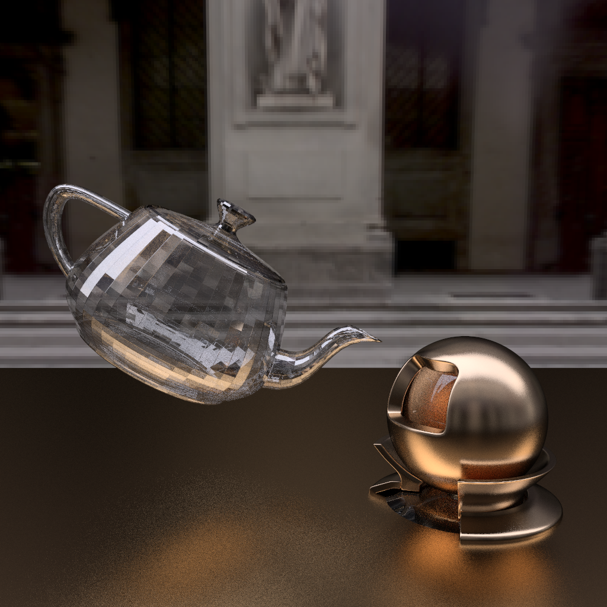

- [Ray Tracer](details/ray-tracer.md) *& Bounding Volume Hierarchy (BVH)*.

    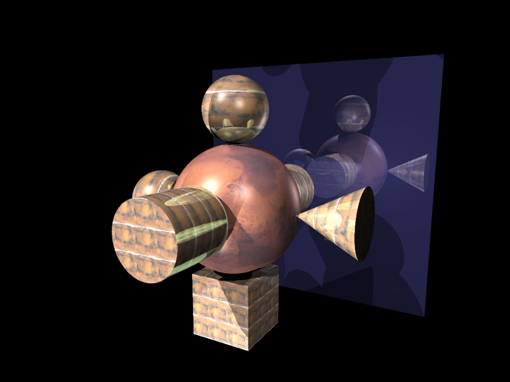
    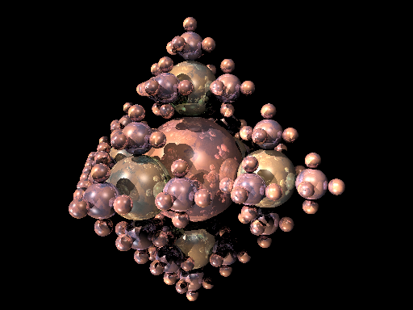

- [Rasterizer](details/rasterizer.md).

    

## Geometry
- [Mesh](details/mesh.md): *Subdivision, Simplification, & Remeshing*.

    <table>
    <tr>
        <td align="center" style="width:50%;">
        <strong>Input</strong> 
        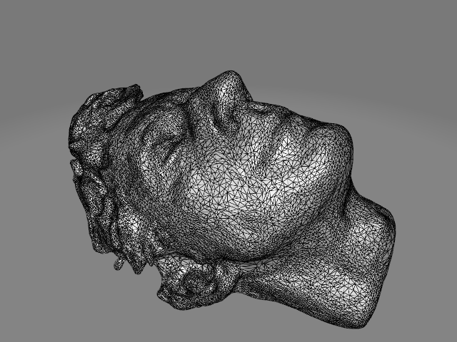
        </td>
        <td align="center" style="width:50%;">
        <strong>Remeshed</strong> 
        
        </td>
    </tr>
    </table>

- [As-Rigid-As-Possible (ARAP)](details/arap.md)

    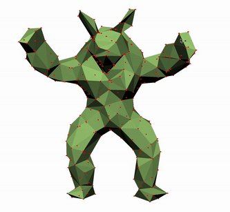

- [L-System](details/l-system.md) *for trees*.

    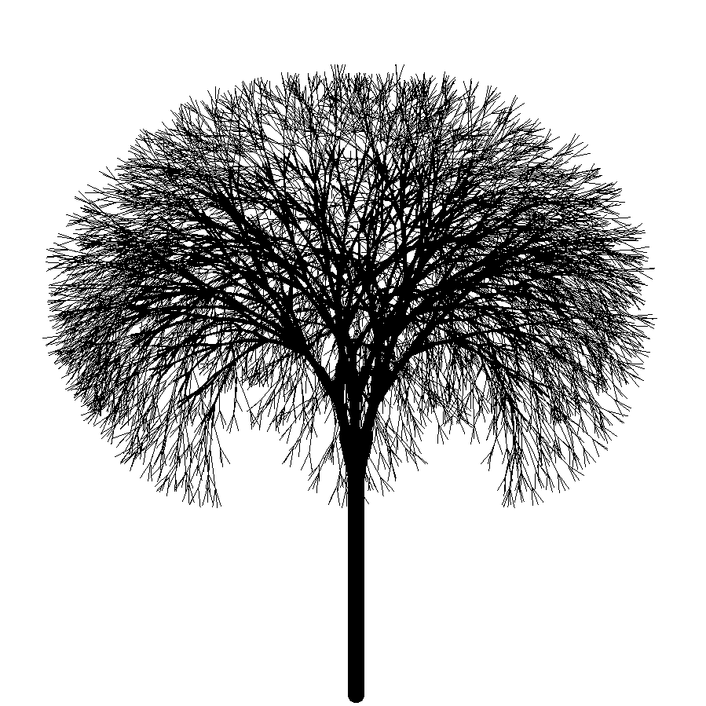
    <!--  -->

## Simulation
- [Material Point Method (MPM) on 3D Gaussians](https://github.com/ranrandy/gaussian-splatting-mpm)

    
    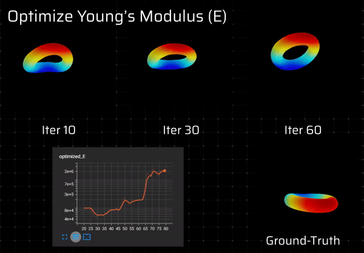

- [Finite Element Method (FEM)](details/fem.md).

    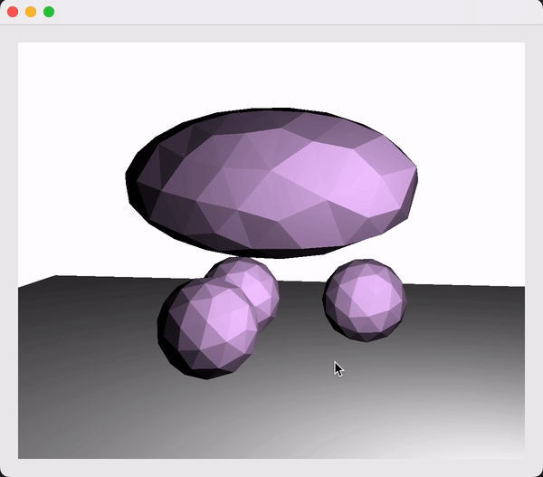

## Computational Photography & Vision
- [Raw 3D Gaussian Splatting](details/raw-3dgs.md)

    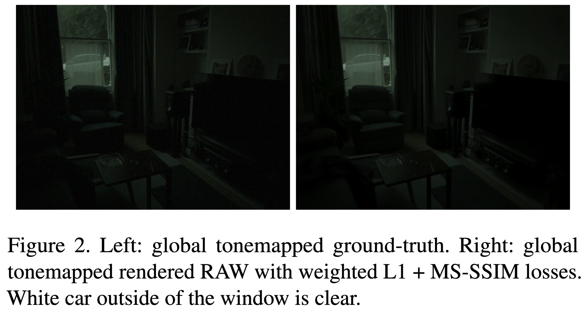

- [Gradient Domain HDR Compression (CUDA)](https://github.com/ranrandy/hdrc)

    <table>
    <tr>
        <td align="center" style="width:50%;">
        <strong>Gamma</strong> 
        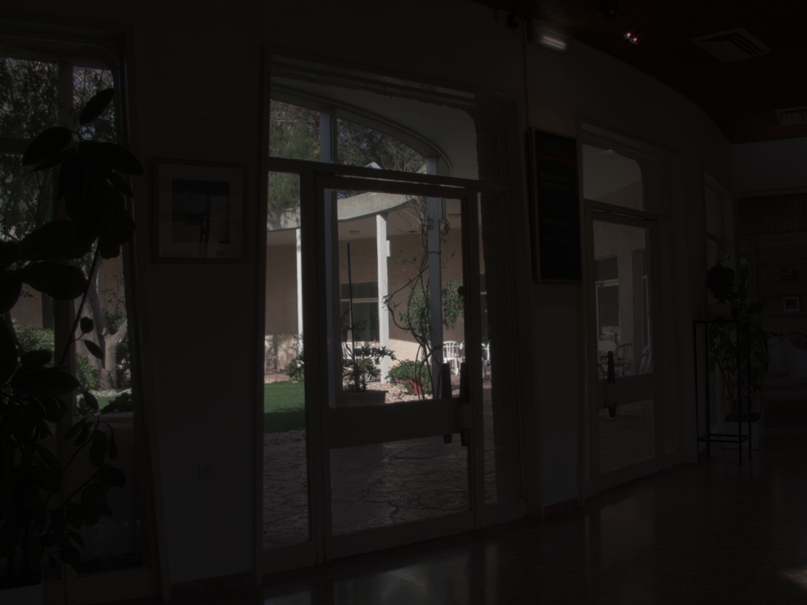
        </td>
        <td align="center" style="width:50%;">
        <strong>HDRC</strong> 
        
        </td>
    </tr>
    </table>

- HDR Imaging & Exposure Fusion

    <table>
    <tr>
        <td align="center" style="width:50%;">
        <strong>Naive Fusion</strong> 
        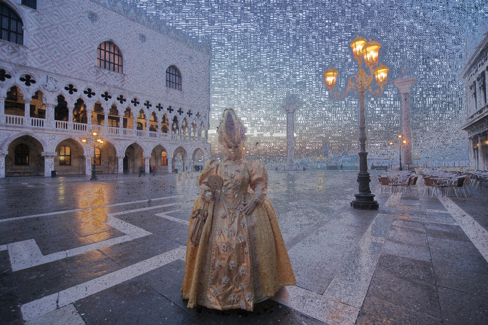
        </td>
        <td align="center" style="width:50%;">
        <strong>Pyramid Fusion</strong> 
        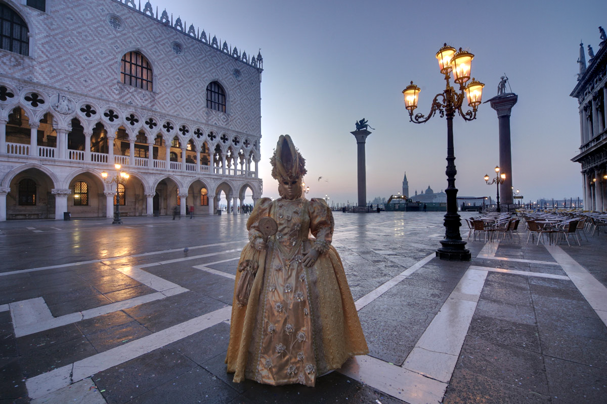
        </td>
    </tr>
    </table>

    

- [View Interpolation](https://github.com/ranrandy/view-interpolation)

    

- Poisson Blending

    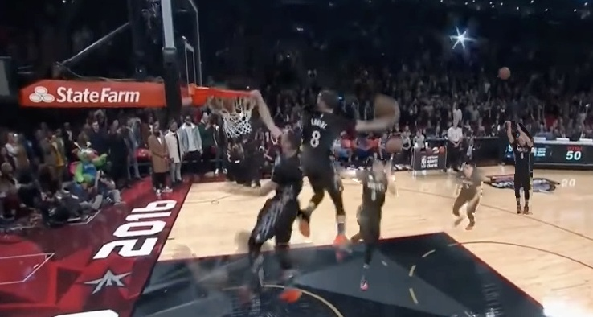

- Texture Transfer

    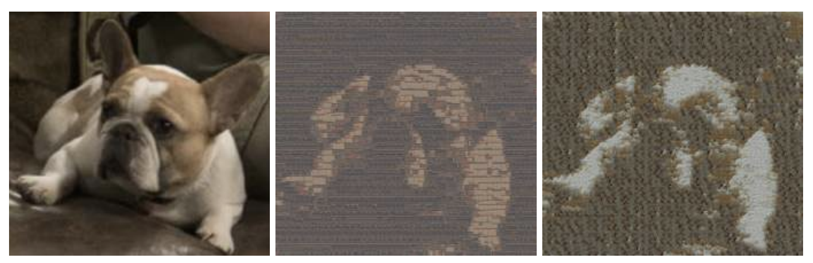

- Panorama - Little Planet

    
