# Gallery
- Rendering
    - Path Tracer
    - Ray Tracer
    - Rasterizer
- Geometry
    - Mesh
    - L-System
- Simulation
    - FEM
    - ARAP
    - MPM + 3DGS, Young's Modulus Estimation
- Computational Photography & Vision
    - HDR, Exposure Fusion
    - Gradient Domain HDR Compression in CUDA
    - Raw 3DGS
    - Poisson Blending
    - Texture Transfer
    - Panorama - Little Planet
    - View Interpolation

---
*Click subtitles to check more results*

## Rendering
- [Monte Carlo Path Tracer](path-tracer.md)
    *& Image-based Lighting (IBL), Importance Sampling, Attenuation in Medium*.

    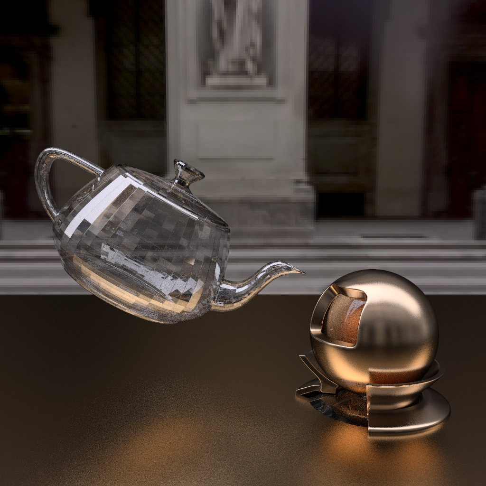

- [Ray Tracer](ray-tracer.md) *& Bounding Volume Hierarchy (BVH)*.

    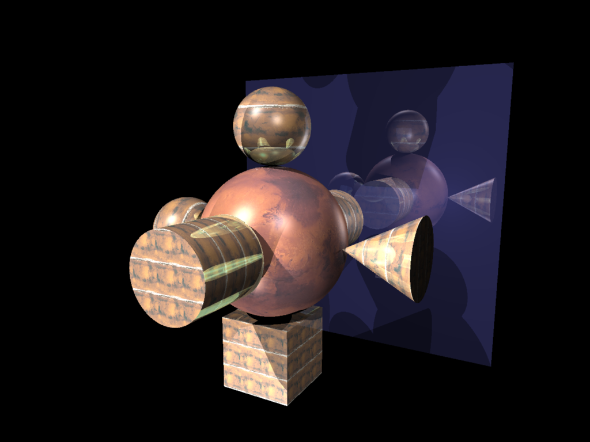
    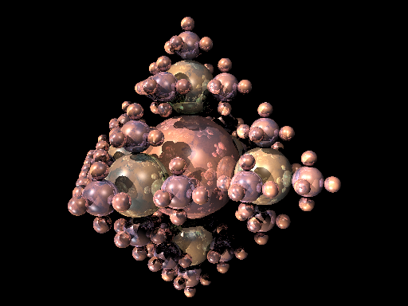

- [Rasterizer](rasterizer.md).

    

## Geometry
- [Mesh](mesh.md): *Subdivision, Simplification, & Remeshing*.

    | **Input**                                  | **Remeshed**                             |
    |:------------------------------------------:|:----------------------------------------:|
    | 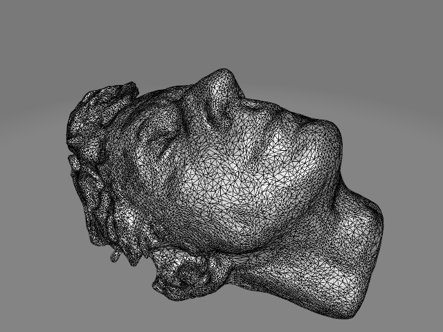 | 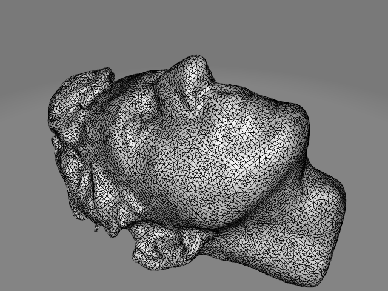 |

- [L-System](l-system.md) *for trees*.

    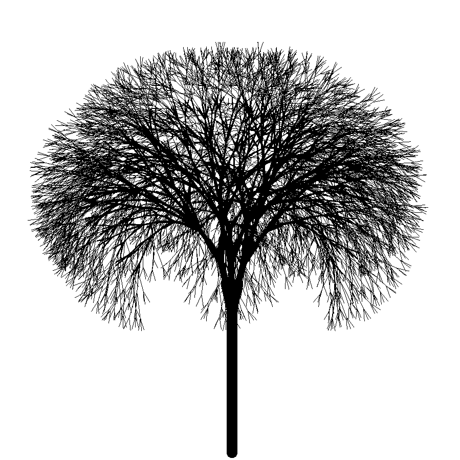
    <!-- 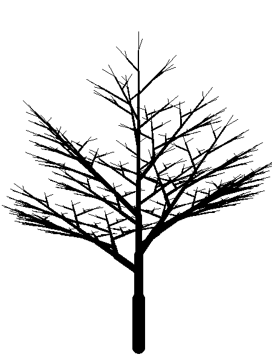 -->

## Simulation
- [Finite Element Method (FEM)](fem.md).

    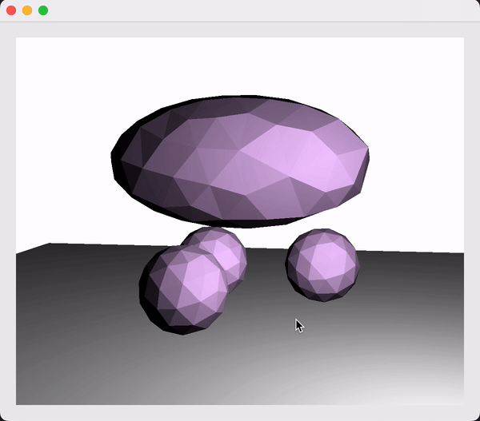

- [As-Rigid-As-Possible (ARAP)](arap.md)

    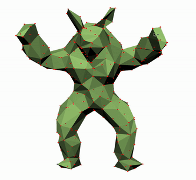

- [Material Point Method (MPM) on 3D Gaussians](https://github.com/ranrandy/gaussian-splatting-mpm)

    
    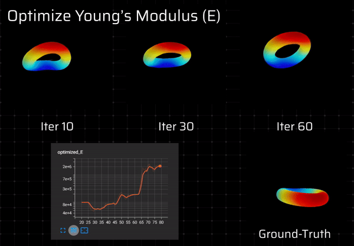

## Computational Photography & Vision
- HDR Imaging & Exposure Fusion

    | **Naive Fusion**                           | **Pyramid Fusion**                       |
    |:------------------------------------------:|:----------------------------------------:|
    | 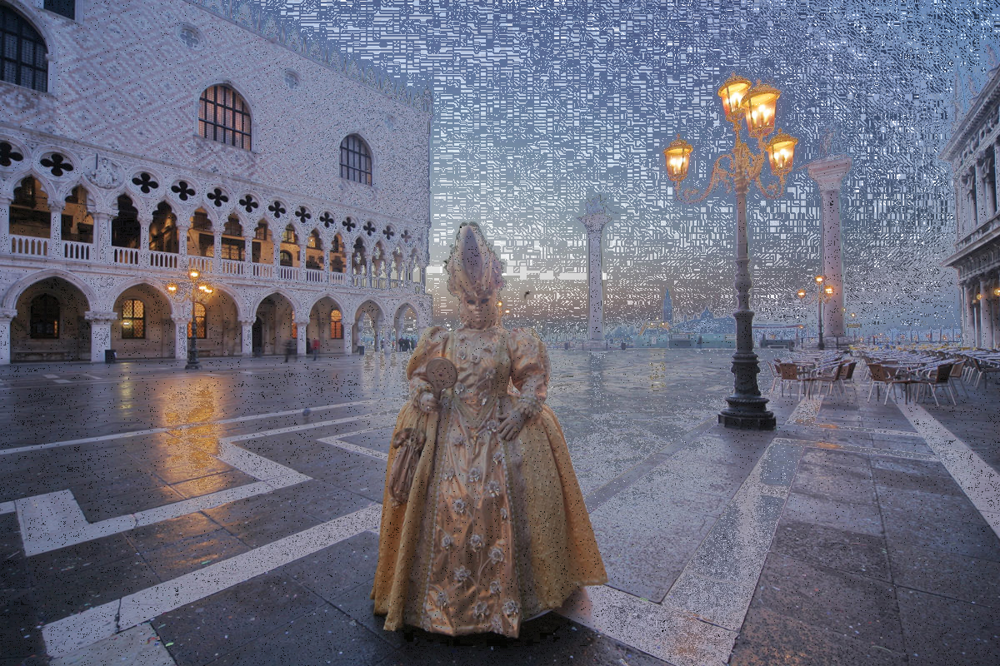 | 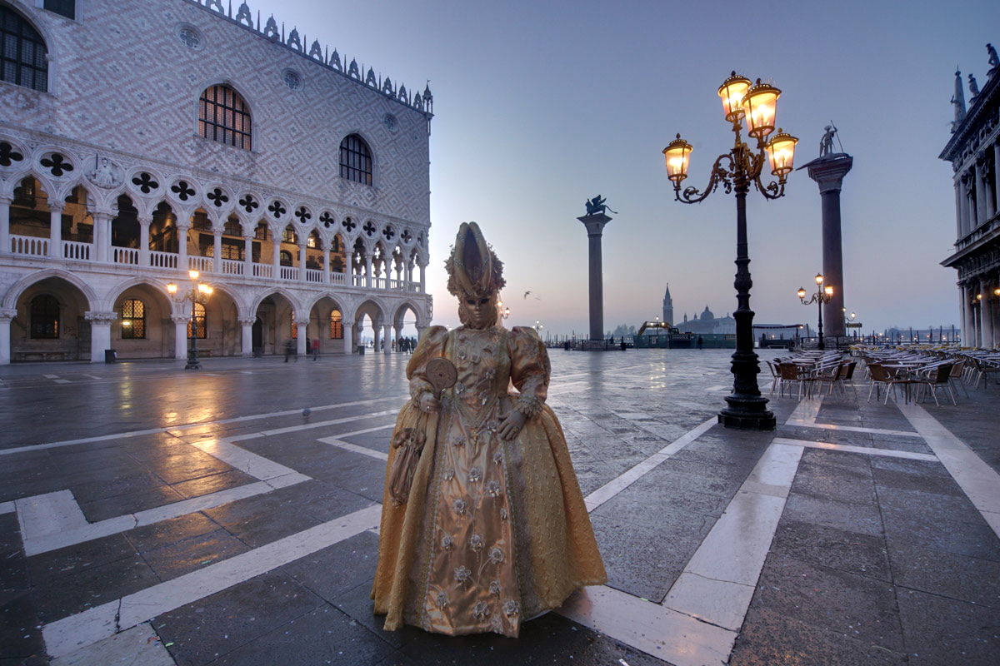 |

    

- [Gradient Domain HDR Compression (CUDA)](https://github.com/ranrandy/hdrc)

    | **Gamma**                                  | **HDRC**                                 |
    |:------------------------------------------:|:----------------------------------------:|
    | 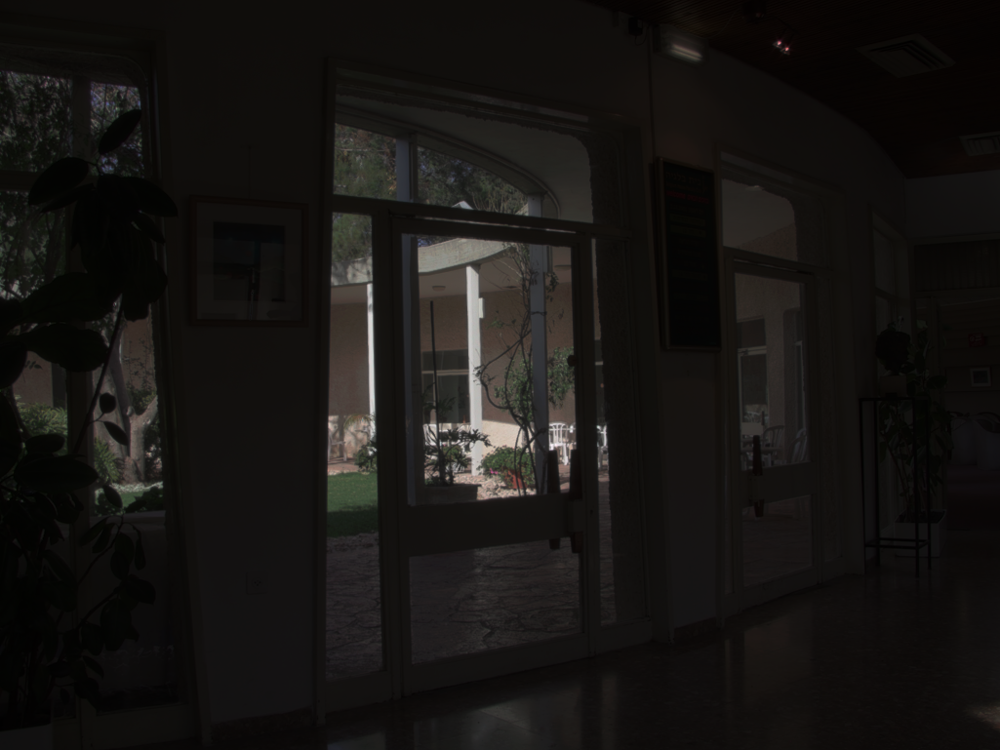     | 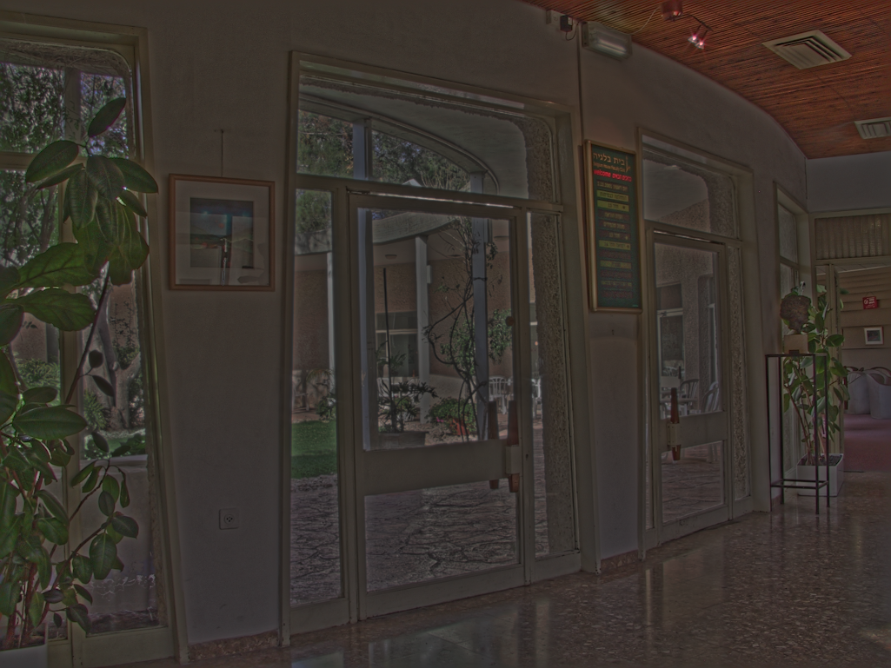     |

- [Raw 3D Gaussian Splatting](raw-3dgs.md)

    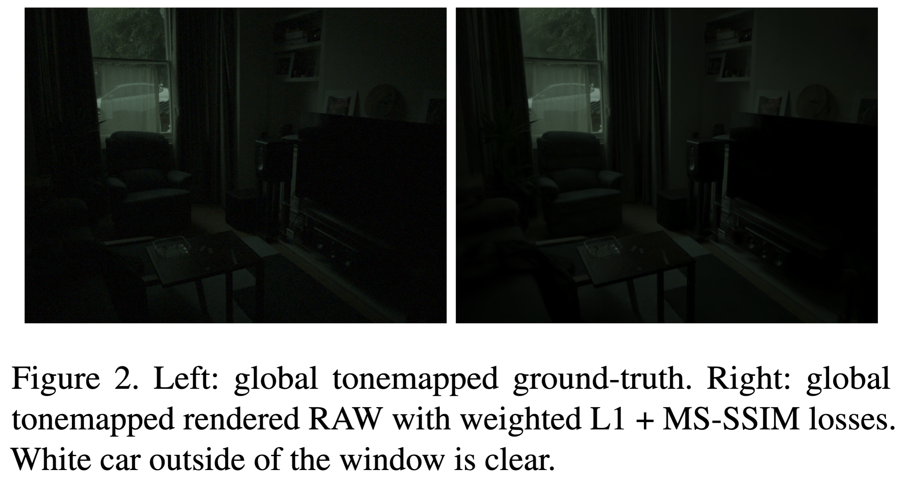

- Poisson Blending

    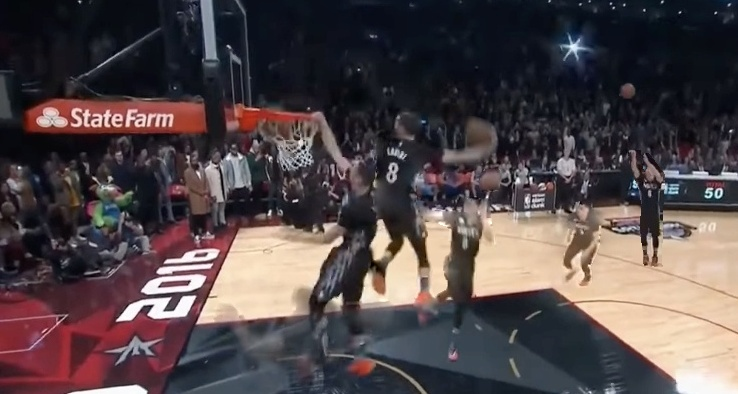

- Texture Transfer

    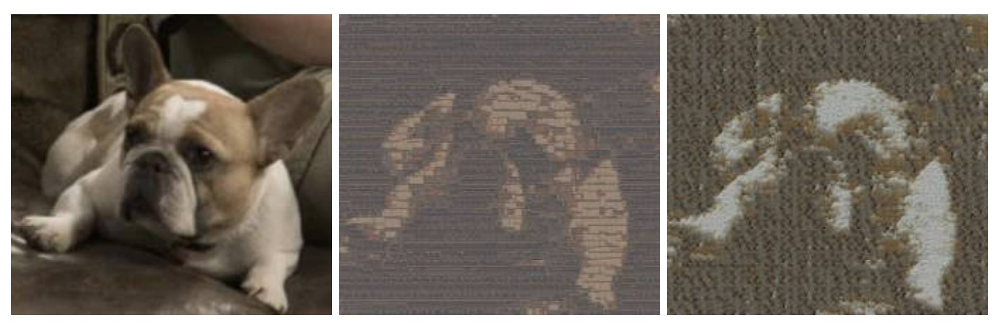

- Panorama - Little Planet

    

- [View Interpolation](https://github.com/ranrandy/view-interpolation)

    
