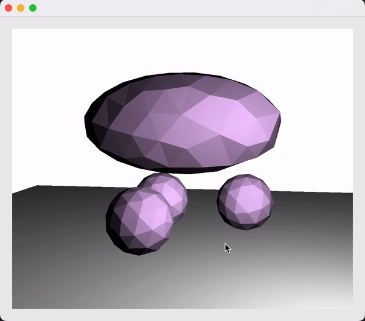

## FEM

Sample Result Video

### Extracting Surface Mesh
We think that if a **face** (eg, f 0 1 2) only appears once, then it is a surface face. Otherwise, it is an inner face. We implement this logic in the `Simulation::extractSurfaceMesh` function.

### Internal forces
We follow the guide line of calculating strain and stress using FEM from lecture slides. We start from the deformation gradient (strain) and deformation velocity gradient (strain rate), and use this matrix to compute stress based on a set of predefined parameters. Check `SimulationMesh::calculateForces` for details.

### Collision Detection
We hardcoded collision detection for ground and sphere in the `SimulationMesh::handleCollisions` function. For ground, we check if the y value of a vertex is smaller than 0.0. For sphere, we compare the distance to sphere center and the sphere radius.

### Time Integration
We implement the Euler, midpoint, and Runge-Kutta 4 method to solve the equations, which have a increasing degree of accuracy.

### Extra Credits
We implement Runge-Kutta 4 method for higher order time integration. We add a few `openmp` statements before the `for` loops that iterate all the vertices or tetrahedrons. 