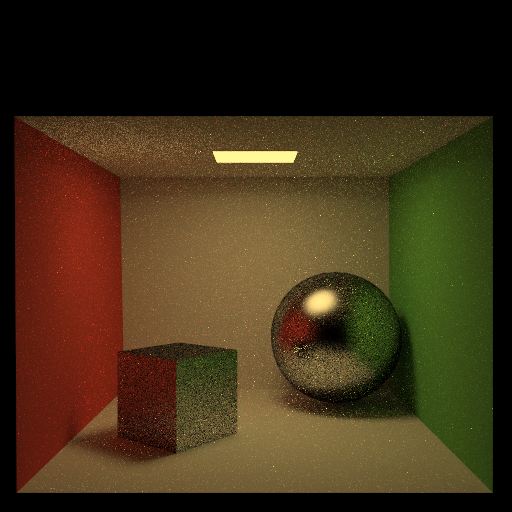

## Path (final submission)

Please fill this out and submit your work to Gradescope by the deadline.

### Output Comparison
Run the program with the specified `.ini` config file to compare your output against the reference images. The program should automatically save to the correct path for the images to appear in the table below.

If you are not using the Qt framework, you may also produce your outputs otherwise so long as you place them in the correct directories as specified in the table. In this case, please also describe how your code can be run to reproduce your outputs

> Qt Creator users: If your program can't find certain files or you aren't seeing your output images appear, make sure to: 
> 1. Set your working directory to the project directory
> 2. Set the command-line argument in Qt Creator to `template_inis/final/<ini_file_name>.ini`

Note that your outputs do **not** need to exactly match the reference outputs. There are several factors that may result in minor differences, such as your choice of tone mapping and randomness.

Please do not attempt to duplicate the given reference images; we have tools to detect this.

| `.ini` File To Produce Output | Expected Output | Your Output |
| :---------------------------------------: | :-------------------------------------------------: | :-------------------------------------------------: |
| cornell_box_full_lighting.ini |   |  |
| cornell_box_direct_lighting_only.ini |   |  |
| cornell_box_full_lighting_low_probability.ini |   |  |
| mirror.ini |   |  |
| glossy.ini |   |  |
| refraction.ini |   |  |

> Note: The reference images above were produced using the [Extended Reinhard](https://64.github.io/tonemapping/#extended-reinhard) tone mapping function with minor gamma correction. You may choose to use another mapping function or omit gamma correction.

### Design Choices
Building upon the milestone codes, we

1. Add glossy BRDF (**evalGlossyBRDF**), mirror BRDF (only trace to the reflection direction), and Fresnel BRDF (only trace to reflection or refraction direction based on the Fresnel coefficient R)

2. Terminate tracing the ray by Russian roulette.

3. Separate direct and indirect lighting (**traceDirectLight**).

4. Sample from emissive triangles (**sampleTriangle**).

### Extra Features 
<table>
  <tr>
    <td width="30%" style="text-align: center">Description</td>
    <td width="60%" colspan="2" style="text-align: center">Output</td>
  </tr>
  <tr>
  <td><b>Teapot-Mitsuba</b> - A Customized Scene  <i>*Remark: This output on the right uses ALL the extra features.</i></td>
  <td  colspan="2" style="text-align: center"></td>
  </tr>
  <tr>
    <td width="30%" style="text-align: Left"> <b>Image-based Lighting.</b>    We use the vertical cross cube map as the environment map (probe), and trace the ray as before. The difference is that we sample (<b>computeUVFromDir</b> and <b>sampleEnvironmentMap</b>) radiance from the environment map when the ray does not have an intersection point.    <i>*Produced using image_based_lighting.ini</i></td>
    <td width="60%" colspan="2" style="text-align: center">
    
    </td>
  </tr>
  <tr>
    <td width="30%" style="text-align: Left"> <b>Importance Sampling for Diffuse & Glossy Surfaces.</b>   Based on the BRDF for ideal diffuse and glossy specular surfaces, we derive the importance sampling of the next direction in <b>importanceSampleHemisphereDiffuse</b> and <b>importanceSampleHemisphereGlossy</b>. We can see a significant reduction of noise from the right glossy sphere. For diffuse surfaces (walls), it is also visible, but not that obvious as glossy surfaces.    Left: <b>without</b> diffuse and glossy importance sampling; Right: <b>with</b> diffuse and glossy importance sampling.    <i>*Produced using glossy_diffuse_wo_importance_sampling.ini</i> and <i>glossy_diffuse_w_importance_sampling.ini</i></td>
    <td width="30%" style="text-align: center">
     </td>
    <td width="30%" style="text-align: center">
    </td>
  </tr>
  <tr>
    <td width="30%" style="text-align: Left"> <b>Attenuation of Light When Travelling within a Medium</b>   We attenuate the contribution of light when it travels within a medium by using <b>L = L_0 * Tf^d</b>. The right glass sphere now becomes darker because of internal light attenuation.    Left: <b>without</b> medium attenuation; Right: <b>with</b> medium attenuation.    <i>*Produced using refraction_wo_medium_attenuation.ini</i> and <i>refraction_w_medium_attenuation.ini</i></td>
    <td width="30%" style="text-align: center">
    
    </td>
    <td width="30%" style="text-align: center">
    </td>
  </tr>
  <tr>
    <td width="30%" style="text-align: Left"> <b>Stratified Sampling over the Pixel Square</b>    We divide the pixel square into smaller grid squares, and uniformly sample from all the smaller grids. We can only see slight improvement around high contrast edges and areas near the light.    Left: <b>without</b> stratified sampling; Right: <b>with</b> stratified sampling.    <i>*Produced using cornell_box_wo_stratified_sampling.ini</i> and <i>cornell_box_w_stratified_sampling.ini</i></td>
    <td width="30%" style="text-align: center">
    
    </td>
    <td width="30%" style="text-align: center">
    </td>
  </tr>
</table>

### Collaboration/References
[1] Uniformly sample from triangle: https://math.stackexchange.com/q/432835

[2] Finding UV coordinate on a sphere: https://en.wikipedia.org/wiki/UV_mapping#Finding_UV_on_a_sphere

[3] Importance sampling of Phong glossy surfaces: https://developer.nvidia.com/gpugems/gpugems3/part-iii-rendering/chapter-20-gpu-based-importance-sampling

[4]

### Known Bugs
No
