# L-system
The plants images/geometry (no mesh) are generated using L-systems from [[1]](http://algorithmicbotany.org/papers/abop/abop.pdf). For simplicity, we do not consider the stochastic and context sensitive L-systems. We do not generate high-resolution flowers, leaves, and so on, but only generate trees.
## 1. Definition
* $V$, alphabet 
* $w\in V^+$, axiom
* $\{p_1, p_2, ...\}$, where $p_i=(a, \chi)\in(V, V^*)$, A set of production rules
* $n$, #iterations

    > From my understanding, the L-system is very similar to the Context Free Grammar (CFG), where we have
    > * $V$, alphabet -> all non-terminals
    > * $w\in V$, a start symbol -> non-terminal
    > * $\{p_1, p_2, ...\}$, where $p_i=(a, \chi)\in(V, V^*)$, A set of production rules 
    >   - To align with the definition of L-system, I finetuned the definition by removing the terminals, but make the right side of the production rule to be $V^*$ instead of $V^+$

    > except that, in the L-system
    > * The axiom can have multiple symbols
    > * In each iteration, we must replace all the symbols using all the productions at the same time.
    >    - The L-system is parallel, thus representing the growth.
    >    - The Context Free Grammar is linear, which makes it more flexible

## 2. Turtle Symbol and Configuration Interpretations:
* ### General
    * $l$, step size
    * $F$ (and $F_l, F_r$), move towards $H$ for a distance of $l$
    * $f$, move towards $H$ for a distance of $l$ without drawing a line
    * $[$, start branching, push current node to stack
    * $]$, end branching, pop last node from stack
    * {, start outlining a leaf
    * }, end outlining a leaf
    * $'$, increase the current index of color
    * $A, B, C, ...$, do nothing
* ### 2-Dimension 
    - $H=(H_x, H_y)$, turtle heading direction
    - $P=(P_x, P_y)$, turtle 2D position
    - $\delta=\alpha$:
        - $+$, turn $H$ towards left for $\alpha$ degree
        - $-$, ... right ...
    - #### Sample 2D non-parametric trees outputs
        Parameters refer to Figure 1.24 in Sec 1.6.3 Bracketed OL-systems (p.25) in [1].

    <table>
        <tr>
            <td>
                
                
(a)

            </td>
            <td>
                
                
(b)

            </td>
            <td>
                
                
(c)

            </td>
        </tr>
        <tr>
            <td>
                
                
(d)

            </td>
            <td>
                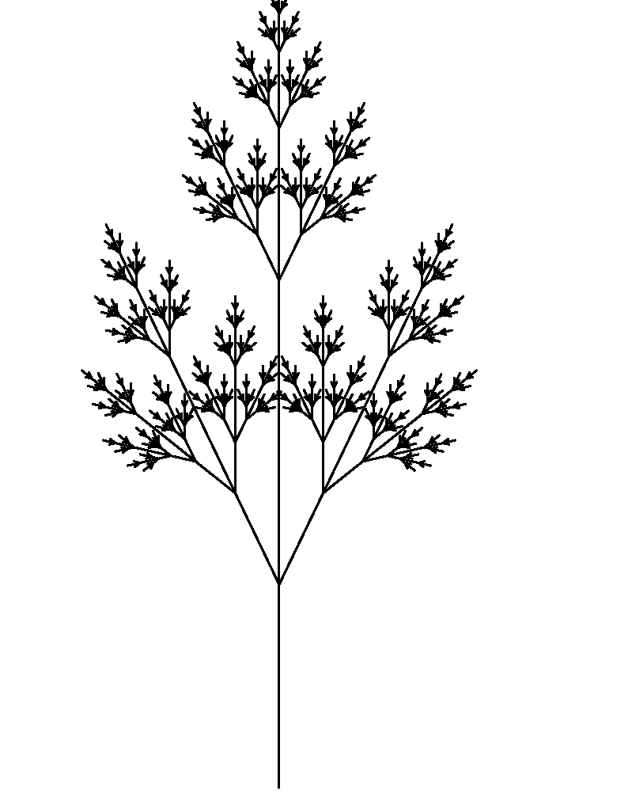
                
(e)

            </td>
            <td>
                
                
(f)

            </td>
        </tr>
    </table>

* ### 3-Dimension
    - $H=(H_x, H_y, H_z)$, turtle heading direction
    - $L=(L_x, L_y, L_z)$, turtle left direction
    - $U=(U_x, U_y, U_z)$, turtle up direction
    - $P=(P_x, P_y, P_z)$, turtle 3D position
    - $\delta=\alpha$: (right-hand rule)
        - $+$, rotate around $U$ towards left for $\alpha$ degree
        - $-$, ... right ...
        - &, rotate around $L$ towards down for $\alpha$ degree
        - $\wedge$, ... up ...
        - $/$, rotate around $H$ towards left for $\alpha$ degree
        - $\backslash$, ... right ...
        - $|$, rotate around $U$ for $180$ degree
    - #### Sample 3D non-parametric trees outputs
        <b style="color:red">IMPORTANT: All the 3D rotations here refer to rotations relative to the current Heading (H), Left (L), and Up (U) directions, but not fixed coordinates like in the traditional yaw, roll, and pitch rotations.</b> 
        For simplicity, we only do a orthogonal projection of the 3D tree onto the xy plane. Parameters refer to Figure 1.25 in Sec 1.6.3 Bracketed OL-systems (p.26) in [1].

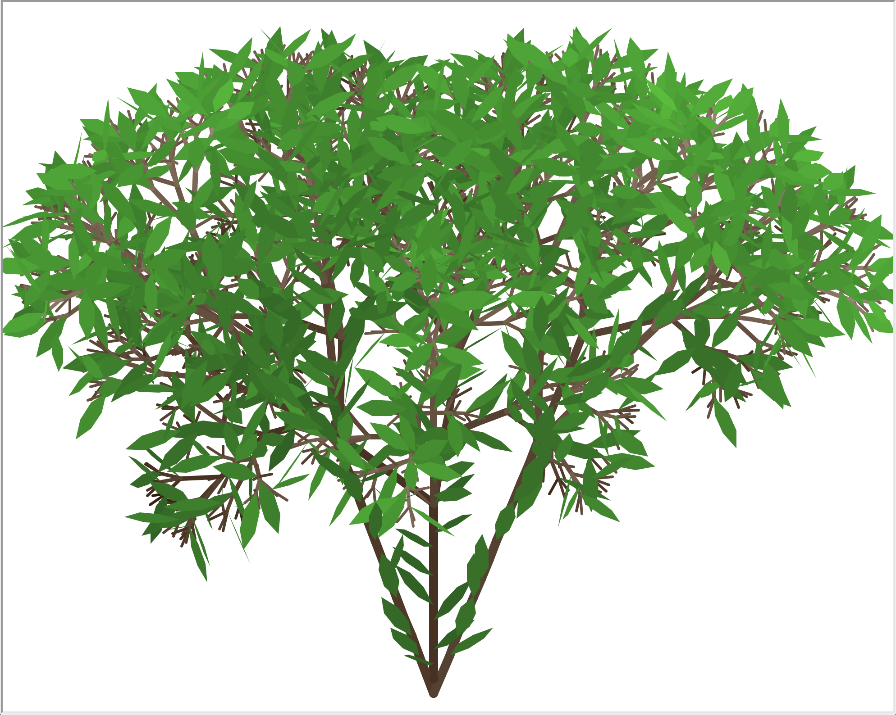

    <!-- 
 -->

* ### Parametric
    - (+, -, & , $\wedge$, $/$, $\backslash$)($\alpha$) = rotate with $\alpha$ degree
    - F(l) = move towards $H$ for $l$
    - !(w) = set trunk/branch thickness to $w$
    - $A, B, C \rightarrow A(a_1, a_2, ...), B(...), ...$, do nothing
    <!-- 
 -->
    <!-- 
[Click here] sample 3D parametric trees outputs
 -->
    - #### Sample 3D parametric trees outputs
        <b>IMPORTANT: Originally, we project the 3D tree to the XY plane. But sometimes, to produce the same image as in [1], we need to project to xz plane, or replace x/z with -x/-z.</b>

    <b>Monopodial Tree. Parameters refer to Figure 2.6 in [1]</b>
    <table>
        <tr>
            <td>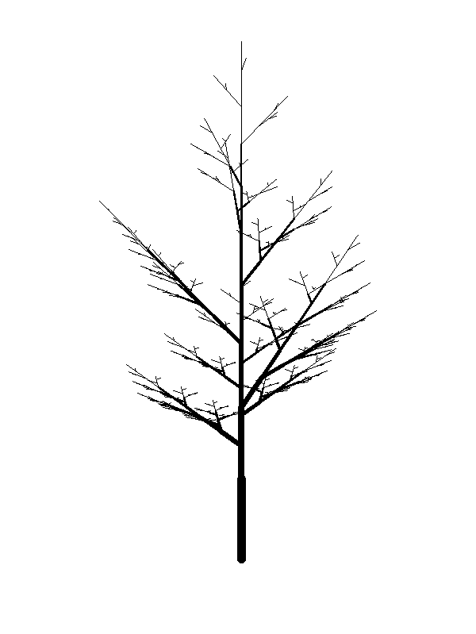
(a)
</td>
            <td>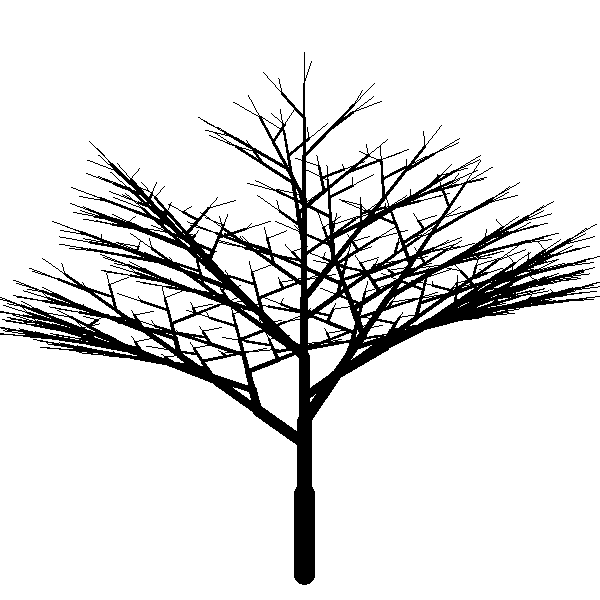
(b)
</td>
            <td>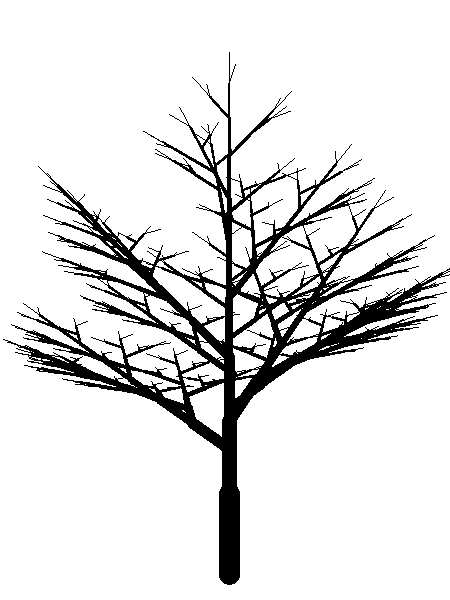
(c)
</td>
            <td>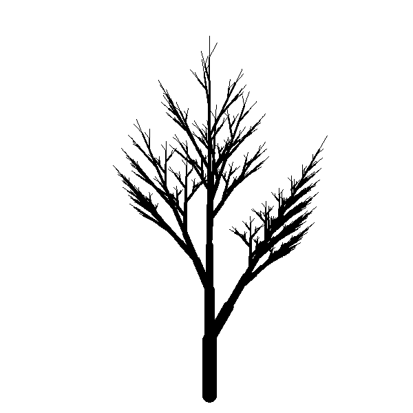
(d)
</td>
        </tr>
    </table>
    <b>Sympodial Tree. Parameters refer to Figure 2.7 in [1]</b>
    <table>
        <tr>
            <td>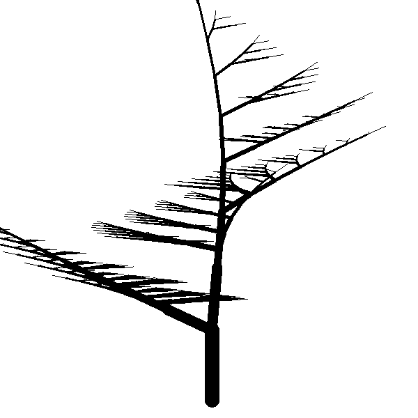
(a)
</td>
            <td>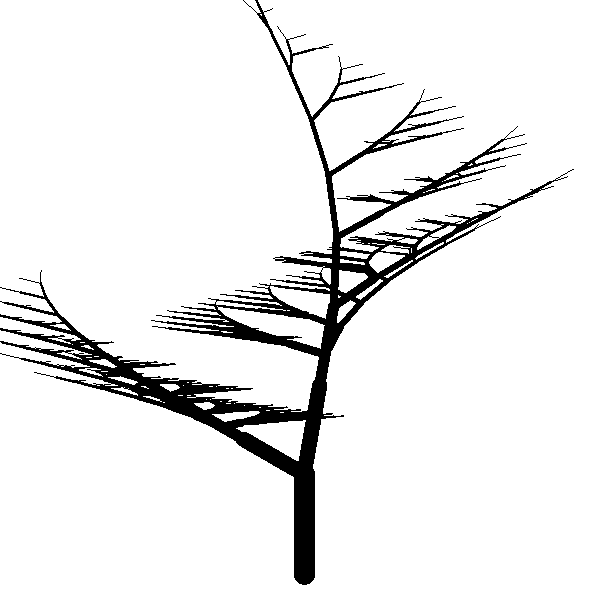
(b)
</td>
            <td>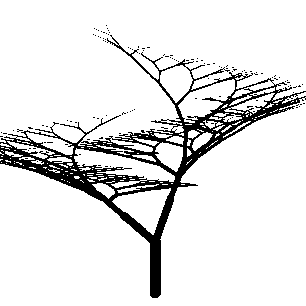
(c)
</td>
            <td>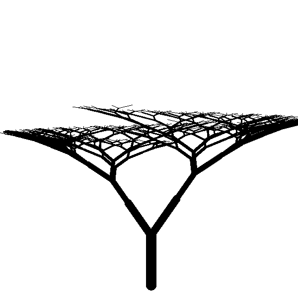
(d)
</td>
        </tr>
    </table>
    <b>Ternary Branching and Tropism (like a force, for example, wind or gravity) Tree</b>
    <b>Parameters refer to Figure 2.8 in [1]</b>
    <table>
        <tr>
            <td>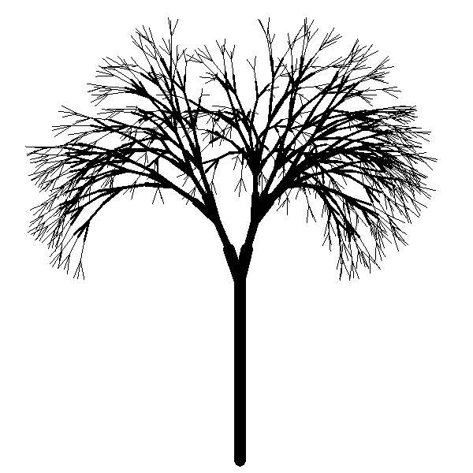
(a)
</td>
            <td>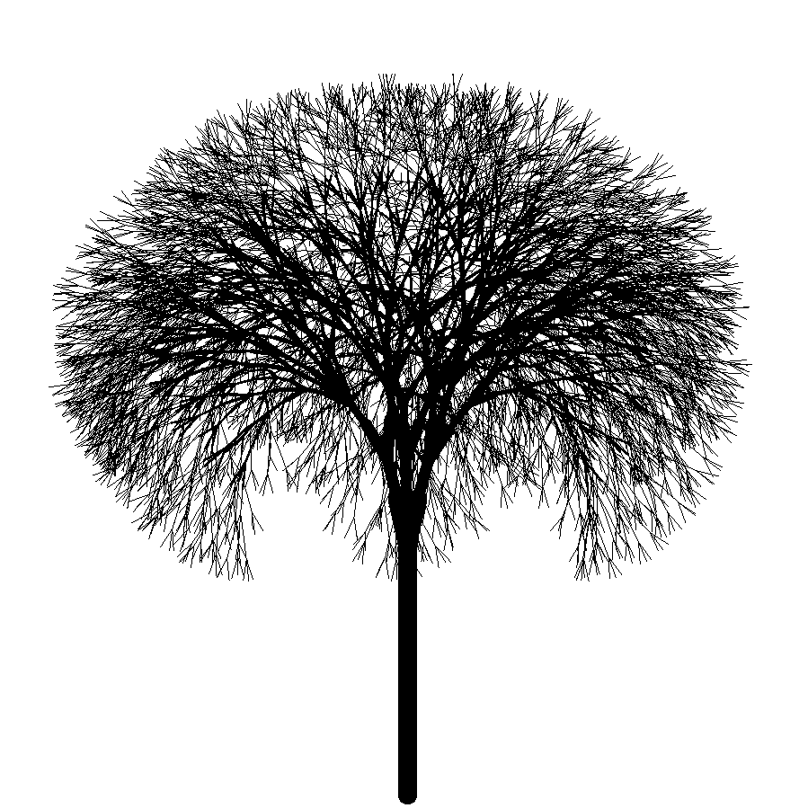
(b)
</td>
        </tr>
    </table>
    There actually are some problems with my output images using Figure 2.8 parameters. But I will just let it go and move forward.

## Usage
Install the `PythonTurtle`, `NetworkX`, and `NumPy` libraries.

Set L-system parameters in `parameters.py` and run `python main.py` in the terminal.

Remark: there might be error (eg, variable not defined) when you run earlier parameters. But the last few 3D cases should be correct.

## Reference:
[1] [The Algorithmic Beauty of Plants](http://algorithmicbotany.org/papers/abop/abop.pdf) - Przemyslaw Prusinkiewicz and Aristid Lindenmayer

[2] [Fractal Trees - L-System](https://youtu.be/E1B4UoSQMFw) - The Coding Train