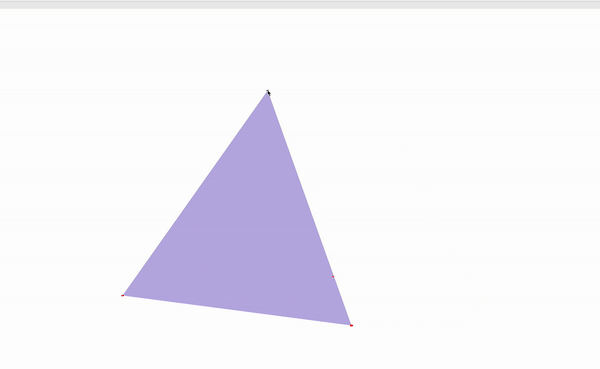

# ARAP

## Introduction
I implemented the classical mesh deformation work, "As-Rigid-As-Possible Surface Deformation". All the basic components of this method are implemented. In addition, I also parallelized the for loops to compute the best rotation matrices, and to compute the right hand side of the linear system using OpenMP, which makes it possible to run large mesh files like `bunny.obj` or `peter.obj`.

## Usage
To run the code, please use QtCreator, and set the cmd argument as, for example, `./inis/peter.ini`. Then run the program.

## Example-Videos

| Program Specification | Our Example |
|:---------------- | :----------------------------------- |
| Anchoring exactly one point, then moving that point, results in perfectly rigid motion (mostly translation, though some rotation for smaller meshes is acceptable).       |       |
| Anchoring exactly two points, then rotating one point around the other at a fixed distance, results in perfectly rigid rotation.                                          |       |
| Deformations are "permanent"; i.e. un-anchoring previously moved points leaves the mesh in its deformed state, and further deformations can be made on the deformed mesh. |         |
| Armadillo waves and kicks.                                                                                                                            |    |
| Attempting to deform `tetrahedron.obj` will not cause it to collapse or behave erratically.                                                                             |  |
| Attempting to deform a (large) mesh like `bunny.obj` or `peter.obj` will not cause your code to crash.                                                                  |        |

## Known Bugs
None

## References
Sorkine, O., & Alexa, M. (2007, July). _As-rigid-as-possible surface modeling_. In Symposium on Geometry processing (Vol. 4, pp. 109-116).