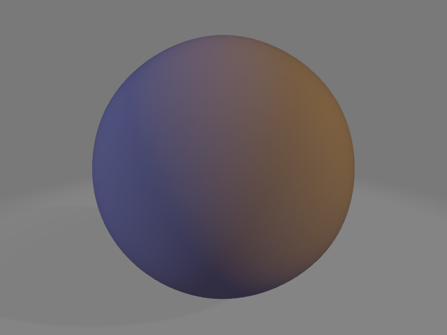
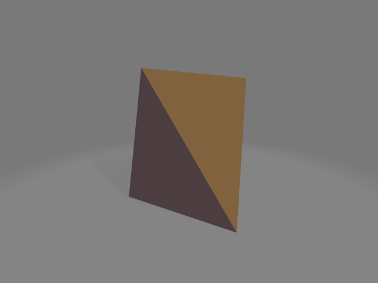
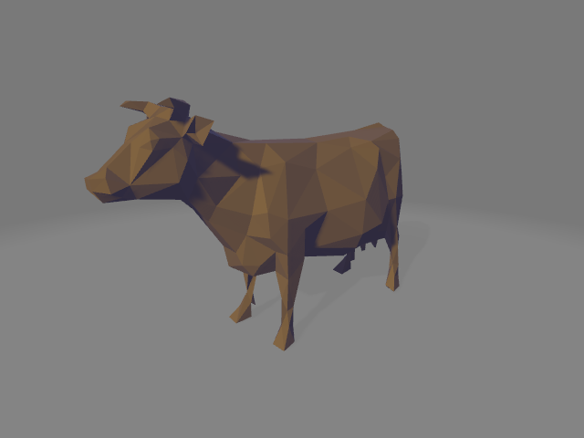
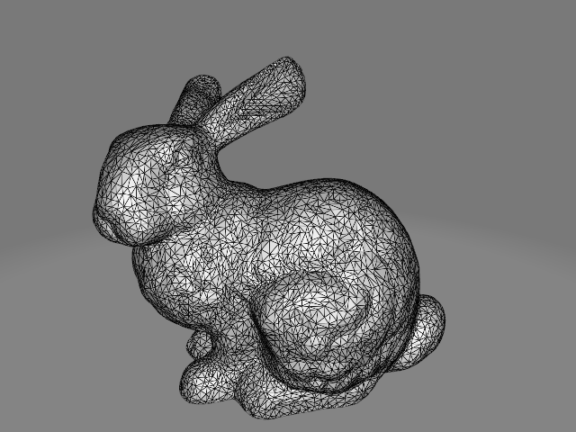
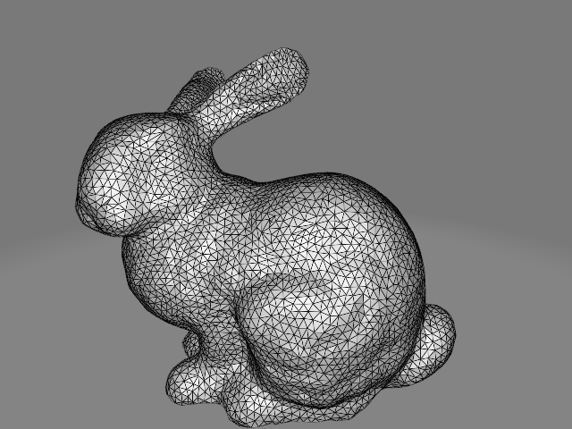
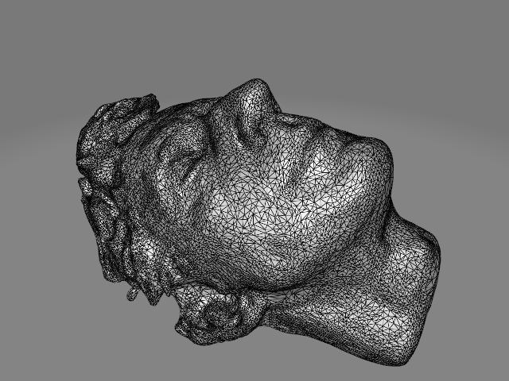
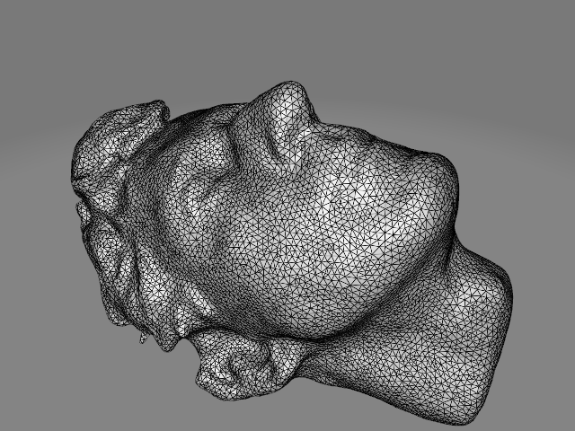
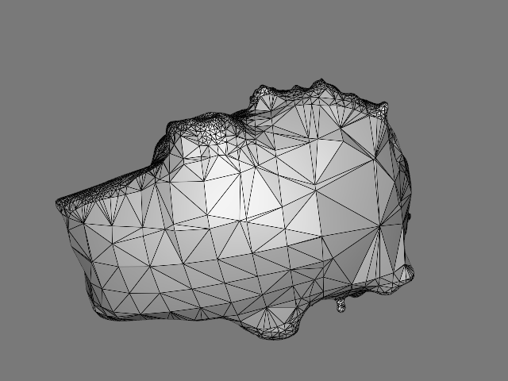
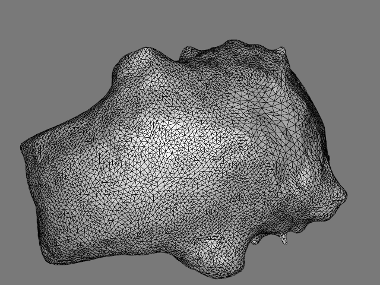

## Mesh (final submission)

Please fill this out and submit your work to Gradescope by the deadline.

### Output Comparison
Run the program with the specified `.ini` config file to compare your output against the reference images. The program should automatically save the output mesh to the `student_outputs/final` folder. Please take a screenshot of the output mesh and place the image in the table below. Do so by placing the screenshot `.png` in the `student_outputs/final` folder and inserting the path in the table.

- For instance, after running the program with the `subdivide_icosahedron_4.ini` config file, go to and open `student_outputs/final/subdivide_icosahedron_4.obj`. Take a screenshot of the mesh and place the screenshot in the first row of the first table in the column titled `Your Output`.
- The markdown for the row should look something like `| subdivide_icosahedron_4.ini |   |  |`

If you are not using the Qt framework, you may also produce your outputs otherwise so long as the output images show up in the table. In this case, please also describe how your code can be run to reproduce your outputs.

> Qt Creator users: If your program can't find certain files or you aren't seeing your output images appear, make sure to:<br/>
> 1. Set your working directory to the project directory
> 2. Set the command-line argument in Qt Creator to `template_inis/final/<ini_file_name>.ini`

Note that your outputs do **not** need to exactly match the reference outputs. There are several factors that may result in minor differences, especially for certain methods like simplification where equal-cost edges may be handled differently.


Please do not attempt to duplicate the given reference images; we have tools to detect this.

| `.ini` File To Produce Output | Expected Output | Your Output |
| :---------------------------------------: | :--------------------------------------------------: | :-------------------------------------------------: | 
| subdivide_icosahedron_4.ini |   |  |
| simplify_sphere_full.ini |   |  |
| simplify_cow.ini |  |  |

Output for Isotropic Remeshing (Note: if you did not implement this you can just skip this part)
| `.ini` File To Produce Output | Input Mesh .png | Remeshed Mesh .png |
| :---------------------------------------: | :--------------------------------------------------: | :-------------------------------------------------: | 
| remesh_bunny.ini |   |  |
| remesh_peter.ini |   |  |
| |   |  |


### Design Choices

#### Mesh Data Structure 
We implement the half edge data structure to prepare for edge operations. The detailed definition of our half edge struct can be found in the `mesh.h` file.

For the milestone, we convert the simple `tinyobj` vertices and faces to `Halfedge`s using the `Mesh::constructHalfEdges()` method. Then we validate the correctness of our half edges using the `Mesh::validate()` method. We could also use this method to validate if our half edges are still correct after each edge operation.

Later on, we add a few more attributes for the `Halfedge`, `Vertex`, and `Face`, such as vertex degree, edge length, vertex quadric (Q), edge cost, optimal collapse position, if this object is active or not, etc., which support more complicated algorithms like mesh simplification and isotropic remeshing.

#### Mesh Validator
We copy our `Mesh::validate()` method here. The `_id_s` assertions check if the id's of vertices, faces and half edges are unique or not. The other assertions should be intuitive.
```
// 1. Validate vertices
std::set<size_t> v_id_s;
for (auto& v : _vertices_he) 
{
    assert(!v->pos.array().isInf().any());
    assert(!v->pos.hasNaN());
    assert(v->halfedge != nullptr);
    assert(v->halfedge->origin == v);
    assert(v_id_s.insert(v->id).second);
}

// 2. Validate faces
std::set<size_t> f_id_s;
for (auto& f : _faces_he) 
{
    assert(f->halfedge != nullptr);
    assert(f->halfedge->face == f);
    assert(f_id_s.insert(f->id).second);
}

// 3. Validate half edges
std::set<size_t> he_id_s;
for (auto& he : _halfedges) 
{
    // We do not consider meshes with boundaries
    assert(he->twin != nullptr && he->twin->twin == he);
    assert(he->next != nullptr && he->next->next->next == he); 
    assert(he->origin != nullptr);
    assert(he->face != nullptr && he->face->halfedge->face == he->face);
    assert(he_id_s.insert(he->id).second);
}
```
#### Algorithm Implementation
We follow the exact algorithms for subdivision, simplification and remeshing. Details can be found from the `subdivide`, `simplify`, and `remesh` methods, respecitively. 

`remesh` takes two float inputs:
1. `target_length` is the target mean length of the remeshed mesh, which could be the mean of the initial mesh. But because the paper mentions that they recommend a slightly smaller number than the initial mean lenght, we also add a target_percentage as an additional parameter to control this target length.
2. `smooth_coeff` is the level of smoothness we can control during the tangential smoothing. Specifically, the parameter corresponds to the `w` when updating the vertex position using `x = x + w * v`, where `x` is the original vertex position, `v` is the difference of `x` and the neighbor centroid that is projected onto the tangential plane, and `w` is a float ranging from 0 to 1. 

#### Run Time/Efficency 
1. <b style="color: orange">[Collapse]</b> Originally, we erase the collapsed edges from the `_halfedges` vector, which introduces a linear / O(n) deletion time into edge collapsing, which is bad. Therefore, instead of removing the collapsed edges (and vertices and faces), we simply set tht status (`isActive`) of these objects to `false`. And when traversing the entire vector of vertices/faces/halfedges, we check if `isActive` is true to determine if we want to process that object. This greatly improved the performance from linear time / O(n) to constant time / O(1).

2. <b style="color: orange">[Simplify]</b> We use the `std::set` data structure to store the candidate edges to collapse, which is sorted, and we can retrieve the elements in the order of their `cost`. In addition, we dynamically update the quadric for vertices before, which we should not do. After removing that part and simply using Q_v1 + Q_v2 as the Q for the merged/collapsed new vertex, our simplify function works faster.

### Collaboration/References
No

### Known Bugs
No