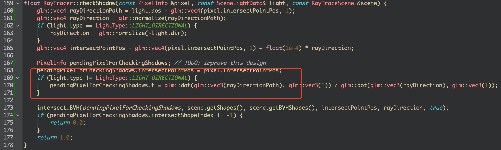

# Ray Tracing from Scratch

---

## Usage
1. Install Qt Creator
2. Replace the path to scene file and output image in raytracing_config.ini with the absolute path to your own files 
3. Open the project using Qt Creator (open the CMakeLists.text file)
4. Run the project using the absolute path to the config file as the command line argument

Only a tiny portion of the details of implementation are shown below. Further details will be completed later during the semester.

## Part A
### Design
1. Raytracescene stores the scene information to be used by the raytracer, including view plane dimension, camera configurations, a list of scene shapes and scene lights.

2. Specifically, Camera stores the camera configuration, and precomputes the camera view matrix, which transforms from the World Space to the Camera Space.

3. The Implicitshapes is a base class for representing various primitives in the scene. When constructing this class, given the Ray (shot from the camera, in Object Space) and the object information (in the Object Space), the inherited classes compute the intersection point (if any) and stores the smallest t for shooting the ray and the intersection point normal (in the Object Space).

4. The Raytracer organizes everything together. In the Render method, for each pixel on the view plane, we first shoot a ray to see if there is any intersection point with any objects in the scene. If any, we compute the light using the Phong Illumination model. Otherwise, we keep the pixel with its original color (background color). When working on each pixel, we iterate all the objects in the scene, and initiate objects using the Implicitshapes classes to get intersection points; we also iterate all the lights in the scene so that we can illuminate the pixel while taking all the lights in the scene into consideration.

### Acceleration
1. Slab's method for ray and unit cube intersection. Referenced from https://gamedev.stackexchange.com/a/18459

### Extra Credits
1. Bounding Volume Hierarchy (constructed in raytracerscene.cpp and traversed in raytracer.cpp if acceleration is true). <b>Be careful with precisions!!!!!!! Set a threshold for number comparison, like (a-b) > 1e-6 but not a>b </b>

Assume no overlapping of objects in the scene, the current building times for BVH using Naive SAH in single thread (max leaf primitives = 4) and the corresponding rendering times (using MacBook Pro 2018) are
| Scenes |  Building BVH (Seconds) | Rendering BVH (Seconds) |
| :---:   | :---: | :---: |
| recursiveCubes4 |  0.01  | 11   |
| recursiveCones4 |  0.01  | 16   |
| recursiveSpheres4 |  0.01  | 14   |
| recursiveSpheres4 |  No BVH | 287   |
| recursiveSpheres5 | 2.5 | 32 |
| recursiveSpheres6 | 5.5 | 181 |
| recursiveSpheres7 | 143 | 1228 |

---

## Part B
Add shadows, reflection, refraction, texture, ... to the raytracer

### Extra Credits
1. Refraction

### Some Fixed Bugs (for my own record)
1. `t1` should be `t2`

2. When checking shadows, the initial `t` should be the number of units to the non-directional light source, but not infinity. Otherwise, if the intersected object is behind, for example, a point light, we would still recognize it as a shadow pixel.

## Todo List:
1. Octree & KD-tree
2. OpenMP & Parallelization
3. Adaptive Super-sampling
4. Mesh Rendering
5. Texture Filtering
6. Depth of Field
7. Soft Shadows
8. Design Improvement
9. Self-shadowing / Self-reflecting in `recursiveCubes4.png`
10. High-resolution output images
11. Test chessboard images
12. Bounding Volume Hierarchy with sorted bounding boxes
13. Generalized implicit sphere, cylinders and cones.
14. Set this repo as `private` before the end of Sep 6.

## Reference
https://browncsci1230.github.io/projects
